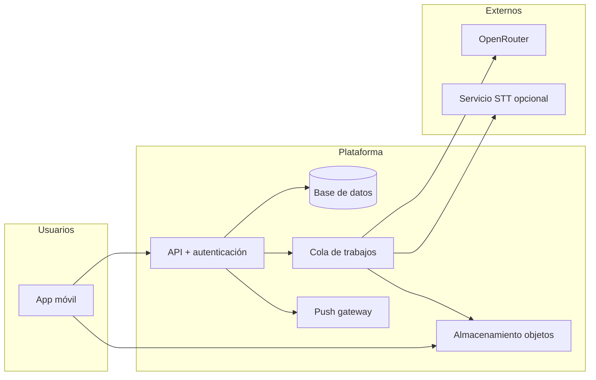
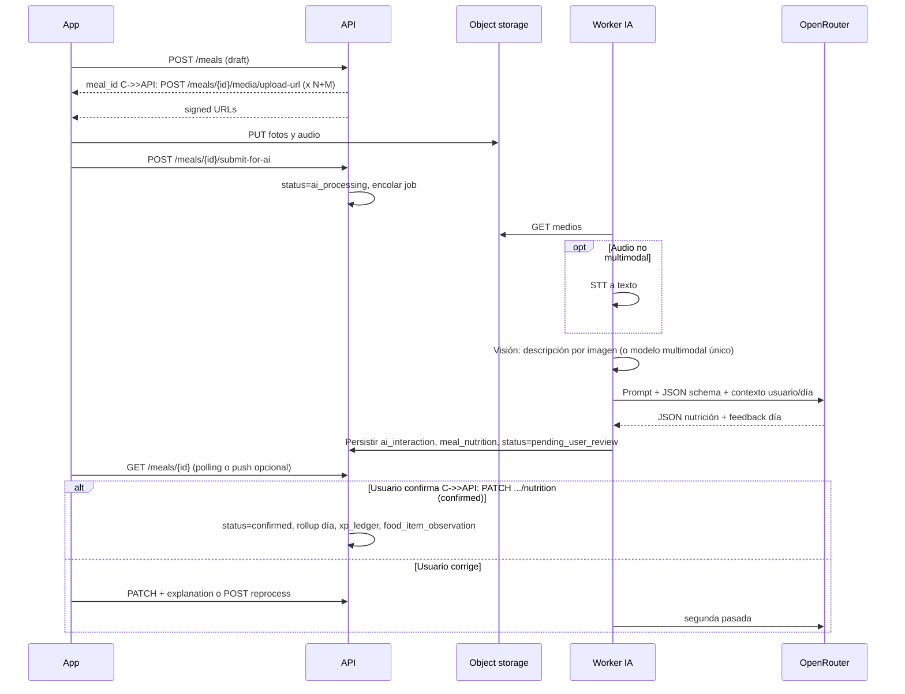

# Diseño técnico v0 — BodyBuilder

Documento de analista técnico. Fuente funcional: `functional_decisions_v1.md`. Alcance aplazado: `deferred_backlog.md` (solo ganchos extensibles).

**Supuestos de implementación** (revisables): backend con API REST (+ WebSockets opcional para notificaciones en tiempo real), BBDD relacional, almacenamiento de objetos para fotos/audio, cola de trabajos para IA y notificaciones. **Cliente inicial:** **web** contra el mismo backend; apps móviles nativas o multiplataforma en fase posterior (integración salud/pasos). Stack concreto del front web se elige en implementación; el diseño de dominio es **agnóstico**.

---

## 1. Contexto del sistema (C4 nivel 1)



- **Cliente**: captura texto/audio/fotos, cola offline, muestra estados de comida (borrador / IA / confirmada).
- **API**: reglas de negocio, agregados del día, social, gamificación, generación de URLs firmadas para subida.
- **Objetos**: binarios (JPEG/WebP, audio AAC/Opus/M4A); metadatos en BBDD.
- **Cola**: inferencia nutricional, transcripción, reintentos, idempotencia.
- **OpenRouter**: modelo LLM (y opcionalmente modelo con visión / multimodal según elección).
- **STT opcional**: si el modelo no acepta audio nativo, transcribir antes (API Whisper u otro) y pasar texto al LLM.

---

## 2. Arquitectura lógica (contenedores)

| Contenedor | Responsabilidad |
|------------|-----------------|
| **App móvil** | UX, reloj local + `timezone` del perfil, cola offline, subida multipart o presigned PUT. |
| **API Gateway / BFF** | OAuth2/OIDC (Google, Apple), JWT de sesión, rate limiting básico. |
| **Servicio de dominio** | Usuarios, días nutricionales, comidas, objetivos, peso/medidas, entreno, informes, social, economía virtual. |
| **Servicio de medios** | Emisión de URLs firmadas, validación MIME/tamaño, virus scan *futuro*. |
| **Workers IA** | Orquestación: ensamblar contexto del usuario + día, llamar STT/visión/LLM, validar JSON, persistir `ai_interaction`. |
| **Workers notificaciones** | Fan-out **siempre** a bandeja in-app; push vía **puerto único** (`NotificationDispatchPort`) con implementaciones: **Web Push (v1)**, **FCM/APNs (futuro nativo)**. |
| **Almacén relacional** | Ver modelo §4. |
| **Object storage** | Claves por `tenant/user/meal_id/uuid.ext`. |

Separar **lectura del día** (agregados materializados o vista) de **escritura de comidas** para mantener el dashboard rápido.

---

## 3. Concepto clave: día nutricional y zona horaria

- Cada usuario tiene `iana_timezone` (ej. `Europe/Madrid`).
- Un **NutritionDay** se identifica por `local_date` (DATE) + `user_id`.
- El cierre del día es **00:00 local** (ampliación futura: `day_cutover_at` — ver funcional).
- Todas las marcas de tiempo de comidas se guardan en **UTC** + se expone `local_time` derivado para UI.

---

## 4. Modelo de datos v0 (entidades y relaciones)

### 4.1 Identidad y perfil

| Entidad | Campos / notas |
|---------|----------------|
| `user` | `id`, `email` nullable, `email_verified_at`, `created_at`, `deleted_at` (borrado lógico futuro). |
| `user_auth_provider` | `user_id`, `provider` (google, apple, password), `provider_subject`, `password_hash` nullable. |
| `user_profile` | `user_id`, `nickname`, `avatar_object_key`, `account_visibility` (**private** \| **public**, estilo Instagram: cuenta privada = solo nick+avatar para no seguidores), `locale` (es), `iana_timezone`, `sex`, `birth_date` o `age`, `bio` opcional. |
| `user_onboarding` | `activity_level`, `training_days_per_week`, datos crudos onboarding; `goal_mode` (volumen_limpio, mantenimiento, definicion, recomposicion, **perdida_peso**); `neat_floor_steps` (valor elegido por usuario); `neat_floor_suggested_steps` (calculado en servidor según `functional_decisions_v1.md` §2.4 bis). |

**Perfil privado**: solo `nickname` + `avatar` visibles para no seguidores; resto oculto (regla de producto).

### 4.2 Objetivos y entreno

| Entidad | Campos / notas |
|---------|----------------|
| `nutrition_target_set` | `user_id`, `effective_from` (date), `source` (computed, manual), `train_day_calories`, `rest_day_calories`, proteína/g/grasas/hidratos; **reparto del delta de entreno:** prioridad **carbs** tras mínimos P/F (regla de negocio); `train_kcal_delta` opcional; `fat_max_g` / `fat_min_g` opcional para techo/mínimo; bandas UI **kcal_green_pct** (default ±7 %, mantenimiento ±5 %) configurables. |
| `daily_activity_context` | `user_id`, `local_date`, `steps` nullable, `neat_notes` nullable, `neat_baseline_steps` nullable (rolling), `neat_floor_steps` nullable (objetivo mínimo en déficit); integración teléfono **futura**. |
| `training_week_template` | `user_id`, bitmask o filas `weekday` 0–6 para patrón recurrente. |
| `training_day_override` | `user_id`, `local_date`, `is_training_day` — toggle del día + excepciones al calendario. |

Cálculo inicial TDEE en servidor (Mifflin–St Jeor + factor actividad) según `functional_decisions_v1.md`; usuario puede **manual override** en `nutrition_target_set`.

### 4.3 Comidas y medios

| Entidad | Campos / notas |
|---------|----------------|
| `meal_slot` | `id`, `user_id`, `name`, `sort_order`, `is_system_default` (desayuno…), soft delete. |
| `meal_entry` | `id`, `user_id`, `local_date`, `meal_slot_id`, `logged_at_utc`, `status` (see below), `title` nullable, `user_note` nullable. |
| `meal_entry_status` | `draft` → `awaiting_media` → `ai_processing` → `pending_user_review` → `confirmed` → (opcional) `corrected`. |
| `meal_nutrition` | `meal_entry_id` 1:1, `kcal`, `protein_g`, `carbs_g`, `fat_g`, `confidence` 0–1, `source` (llm, manual, template, frequent). |
| `meal_line_item` | Opcional: desglose por alimento inferido (nombre, gramos, kcal, P/C/F). |
| `meal_media` | `meal_entry_id`, `type` (image, audio), `object_key`, `mime`, `size_bytes`, `duration_sec` nullable, `uploaded_at`. |
| `meal_correction` | Historial: `meal_entry_id`, `previous_snapshot` JSON, `user_explanation_text` nullable, `audio_object_key` nullable, `created_at`. |

### 4.4 IA y trazabilidad

| Entidad | Campos / notas |
|---------|----------------|
| `ai_interaction` | `id`, `meal_entry_id` nullable, `evaluation_id` nullable, `coaching_message_id` nullable, `direction` (request/response), `model_id`, `openrouter_request_id` nullable, `input_summary` (JSON: hashes/refs a medios, transcript), `output_raw` (texto), `output_parsed` (JSON validado), `latency_ms`, `token_usage` JSON. |
| `coaching_thread` | `id`, `user_id`, `opened_at`, `last_message_at`, `summary_compact` (texto para contexto LLM, refrescado por job), `expires_at` (**última actividad + 7 días**, ventana deslizante), `status` (active, purged). **Job de retención:** si `now > expires_at`, borrar hilo + mensajes + objetos **solo-coach** + `ai_interaction` huérfanas del hilo (no tocar `meal_entry` confirmadas). |
| `coaching_message` | `thread_id`, `role` (user, assistant, system), `body_text`, `linked_meal_entry_id` nullable, `created_at`; adjuntos: `coaching_attachment_object_key` opcional (no reutilizar para comidas confirmadas sin copiar). |

Política: conservar mientras exista el usuario; borrar en cascada al borrar cuenta (definición legal detallada en backlog).

### 4.5 Catálogo interno incremental

| Entidad | Campos / notas |
|---------|----------------|
| `food_item_observation` | `normalized_name`, `per_100g_or_serving` JSON, `seen_count`, `last_seen_at`, `source_user_id` nullable (anonimizar agregados en futuro). |
| Enriquecimiento | Tras cada comida **confirmada**, extraer líneas normalizadas y **upsert** estadístico para prompts futuros (no bloqueante). |

### 4.6 Peso, medidas, fotos, hitos

| Entidad | Campos / notas |
|---------|----------------|
| `weight_entry` | `user_id`, `local_date` o `measured_at_utc`, `kg`, `smoothed_flag` computado en job opcional. |
| `body_measurement` | `user_id`, `type` (cintura, cadera, pecho, muslo, brazo, cuello), `cm`, `measured_at_utc`. |
| `progress_photo_set` | `user_id`, `local_date`, `front_object_key`, `side_object_key`, **privado**. |
| `milestone` | `user_id`, `preset_code` nullable, `free_text`, `achieved_at`. |

### 4.7 Evaluaciones periódicas

| Entidad | Campos / notas |
|---------|----------------|
| `evaluation_report` | `user_id`, `period_start`, `period_end`, `granularity` (week, month), `charts_spec` JSON (qué series mostrar), `llm_narrative` text nullable, `generated_at`. |

### 4.8 Social (MVP)

| Entidad | Campos / notas |
|---------|----------------|
| `follow` | `follower_id`, `followed_id`, `status` (**pending** \| **active** \| eliminado al rechazar), `created_at`, `responded_at` nullable. Reglas: si `followed.account_visibility=private` → crear **pending** hasta `accept`; si **public** → **active** inmediato. Solo **active** cuenta para ver feed del otro. |
| `user_device` | `user_id`, `channel` (web_push, fcm, apns), `subscription_json` (clave VAPID + endpoint web, o token nativo futuro), `created_at`, `last_seen_at`. |
| `post` | `author_id`, `visibility` (public, followers), `body_text`, `image_object_key` nullable, `linked_nutrition_day` nullable (`user_id` + `local_date` snapshot), `achieved_goals` JSON array — códigos alineados con `functional_decisions_v1.md` §5.1 (`app_open`, `calories_in_green`, `protein_target_met`, `fat_max_respected`, `fat_min_met`, `measures_due_done`, `weight_logged`, `neat_floor_met`, `all_meals_logged`, …). |
| `post_like`, `post_comment` | Estándar; `comment.body`, timestamps. |

Moderación/descubrimiento: **no** en esquema v0.

### 4.9 Gamificación

| Entidad | Campos / notas |
|---------|----------------|
| `user_gamification` | `user_id`, `xp_total`, `level`, `currency_determination` (entero). |
| `xp_ledger` | `user_id`, `delta`, `reason_code`, `ref_type`, `ref_id`, `created_at` (auditoría). |
| `cosmetic_item` | catálogo: `code`, `type` (name_color, avatar_frame, trophy). |
| `user_cosmetic_unlock` | `user_id`, `cosmetic_id`, `unlocked_at`. |
| `user_cosmetic_equipped` | preferencias de equipo para perfil. |

Anti-abuso avanzado: backlog; MVP puede limitar XP por `reason_code`/día en código.

### 4.10 Notificaciones

| Entidad | Campos / notas |
|---------|----------------|
| `notification_prefs` | flags por tipo (likes, comments, **follow_request**, follow_accepted, push enabled por canal). |
| `notification_outbox` | `user_id`, `type`, `payload` JSON, `read_at`, `push_dispatched_at` nullable (intento vía puerto). |

**Patrón de código (obligatorio en implementación):** un único **servicio de dominio** (p. ej. `NotificationDispatcher`) que persiste in-app y llama a `NotificationDispatchPort.send(event, devices)`. Implementaciones: `WebPushNotificationAdapter` (v1), `FcmNotificationAdapter` / `ApnsNotificationAdapter` (stub o no-op hasta nativo). Ningún worker debe importar directamente el SDK de FCM en la primera versión web-only del adaptador móvil.

### 4.11 Extensiones futuras: suscripción y pase de batalla (*no MVP privado*)

Diseño orientativo para no pintarse en un rincón cuando exista monetización:

| Entidad | Notas |
|---------|--------|
| `subscription` | `user_id`, `tier` (free, member), `status` (active, canceled, past_due), `current_period_end`, `provider` (stripe…), `external_customer_id`. |
| `feature_entitlement` | Opcional: `user_id`, `feature_code`, `source` (subscription, promo), `expires_at`. |
| `battle_pass_season` | `id`, `name`, `starts_at`, `ends_at`, `config_json`. |
| `battle_pass_tier` | Nivel de recompensa en el pase (gratis / premium track); `subscriber_bonus` flag. |
| `mission` | `season_id`, `criteria` (JSON evaluable en servidor), `reward_currency`, `reward_cosmetic_id` nullable, `subscriber_extra_reward` JSON nullable. |
| `user_mission_progress` | `user_id`, `mission_id`, `progress` JSON, `completed_at` nullable, `claimed_at` nullable. |

La API y workers se añaden cuando el producto cierre el alcance de monetización; en el MVP se puede omitir toda la tabla o dejar `subscription.tier=free` fijo.

---

## 5. Contrato API (capacidades v0, REST)

Prefijo `/v1`. Autenticación: **Bearer JWT** tras login (email/password o OAuth). IDs UUID.

**Auth**: `POST /auth/register`, `POST /auth/login`, `POST /auth/oauth/{google|apple}`, `POST /auth/refresh`, `POST /auth/logout`.

**Perfil / onboarding**: `GET/PATCH /me`, `POST /onboarding/complete`.

**Zona horaria y slots**: `GET/PATCH /me/timezone`, `CRUD /meal-slots`.

**Día y dashboard**: `GET /days/{local_date}` — agregado kcal/P/C/F, objetivos del día (entreno/descanso), lista de `meal_entry` resumida.

**Comidas**:
- `POST /meals` — crea borrador (`status`), opcionalmente `meal_slot_id`.
- `POST /meals/{id}/media/upload-url` — devuelve URL firmada + campos para `PUT`.
- `POST /meals/{id}/submit-for-ai` — marca listo para cola; valida que haya al menos foto o audio.
- `GET /meals/{id}` — estado + última propuesta nutricional.
- `PATCH /meals/{id}/nutrition` — confirmación o edición manual (crea `meal_correction` si había valor previo).
- `POST /meals/{id}/reprocess` — nueva ronda IA con explicación usuario (texto o nuevo audio).

**Objetivos**: `GET/PATCH /nutrition-targets`, `GET /training-calendar`, `PUT /training-calendar`, `PUT /days/{date}/training-override`.

**Peso / medidas / fotos / hitos**: `CRUD` bajo recursos dedicados.

**Evaluaciones**: `GET /evaluations?from=&to=&granularity=`, `POST /evaluations/generate` (async).

**Actividad / NEAT:** `GET/PATCH /days/{local_date}/activity` — pasos u otros proxies; usado para sugerencias en volumen y piso NEAT en déficit.

**Coach (hilo conversacional):** `GET /coaching/thread` (activo o crear), `POST /coaching/thread/{id}/messages` — mensaje usuario o petición de consejo; el worker puede enlazar últimas comidas del día en el contexto.

**Social**:
- `POST /users/{id}/follow` — si objetivo **privado** → `follow.status=pending` + notificación al objetivo; si **público** → `active`.
- `DELETE /users/{id}/follow` — cancelar solicitud o dejar de seguir.
- `GET /me/follow-requests` — solicitudes entrantes **pending**.
- `POST /me/follow-requests/{follow_id}/accept` | `.../reject`.
- `GET /feed/following` — posts de usuarios seguidos con **active** + visibilidad compatible.
- `GET /feed/public` — posts **public** de autores con cuenta **public** (timeline global MVP).
- `GET /feed` — opción: combinar según query `?mix=1` o dejar solo al cliente (tabs).
- `POST /posts`, `GET /posts/{id}`, comentarios/likes.
- `POST /me/devices` — registrar suscripción **Web Push** (JSON); futuro: token FCM/APNs mismo recurso con `channel`.

**Gamificación**: `GET /me/gamification`, `GET /shop/cosmetics`, `POST /shop/purchase`.

**Notificaciones**: `GET /notifications`, `PATCH /notifications/{id}/read`, `PATCH /me/notification-prefs`.

**Idempotencia**: header `Idempotency-Key` en `POST` que crean dinero/XP o comidas desde cliente offline.

---

## 6. Flujo crítico: comida con foto(s) + audio



**Estados visibles en cliente**: “Subiendo medios” → “Analizando” → “Revisa valores” → “Guardado”. Errores: reintento manual + soporte log por `ai_interaction.id`.

---

## 7. Otros flujos (resumen)

| Flujo | Punto técnico clave |
|-------|---------------------|
| **Ajuste objetivos por peso** | Job semanal o on-demand: calcula tendencia (mediana/semana), propone nuevo `nutrition_target_set`; usuario **confirma** via `PATCH`; historial de targets. |
| **Post social con resumen del día** | `POST /posts` con `linked_nutrition_day`; servidor valida que el día pertenece al autor y ensambla `achieved_goals` desde reglas de adherencia (umbrales configurables). |
| **Offline** | Cola local: operaciones con `client_uuid`; al reconectar, API deduplica por `Idempotency-Key` + `client_uuid` único en tabla `client_mutation`. |
| **Evaluación semanal** | Worker agrega series, LLM genera narrativa corta + `charts_spec`; cliente renderiza gráficos desde datos numéricos (no confiar en números generados por LLM). |

---

## 8. Pipeline IA y JSON de salida

### 8.1 Entrada al modelo

- Texto estructurado: transcript del audio, descripciones de imágenes (o píxeles si el modelo es multimodal).
- Contexto: objetivos del `local_date`, consumo acumulado del día, modo objetivo usuario, peso reciente opcional.
- Instrucción: estimar P/C/F/kcal, confianza, líneas comida; tono prudente; **no** diagnóstico médico.

### 8.2 Esquema JSON sugerido (validación en worker)

```json
{
  "meal_summary": "string",
  "line_items": [
    {
      "name": "string",
      "estimated_grams": "number|null",
      "kcal": "number",
      "protein_g": "number",
      "carbs_g": "number",
      "fat_g": "number"
    }
  ],
  "totals": {
    "kcal": "number",
    "protein_g": "number",
    "carbs_g": "number",
    "fat_g": "number",
    "confidence": "number"
  },
  "day_feedback": "string",
  "assumptions": ["string"],
  "disclaimer": "string"
}
```

Si el parseo falla: reintento con prompt “solo JSON”, o degradación a estimación manual en cliente.

### 8.3 Modelos: multimodal vs cadena (STT + visión + LLM)

| Enfoque | Qué es | Pros | Contras |
|---------|--------|------|---------|
| **Multimodal único** | Un solo modelo recibe imagen + audio (o embeddings) y devuelve JSON. | Menos piezas, latencia potencialmente menor. | Menos control por paso; depender de pocos modelos en OpenRouter; depuración más densa. |
| **Cadena** | p. ej. **STT** (audio→texto) + **visión** (imagen→descripción estructurada o JSON) + **LLM texto** que unifica y devuelve el esquema nutricional. | Depuración clara, fallback por etapa, elección óptima de modelo por tarea. | Más llamadas, más latencia y coste acumulado si no se optimiza. |

**Recomendación para este proyecto (v1):** **cadena**, por fiabilidad del JSON, trazabilidad por etapa (STT vs visión vs razonamiento) y facilidad de sustituir un proveedor en un solo eslabón. Cuando un modelo multimodal estable dé **paridad de calidad + coste**, se puede encapsular detrás de la misma interfaz `NutritionEstimator` y conmutar por configuración.

- Fallback: segundo `model_id` configurado por entorno en la etapa LLM (y STT alternativo si aplica).

---

## 9. No funcionales v1 (mínimo)

| Área | v0 |
|------|-----|
| Seguridad | JWT corto + refresh; HTTPS; secretos en vault; OAuth state/nonce. |
| Datos | Backups automáticos BBDD + lifecycle en object storage; cifrado en tránsito. |
| Observabilidad | `request_id`, logs estructurados, métricas latencia OpenRouter, cola depth. |
| Coste | Contador tokens/por usuario/día en logs; alertas manual. |
| RGPD / accesibilidad | Backlog formal; diseño permite borrado en cascada por `user_id`. |

---

## 10. Orden de implementación (hitos)

1. **H1 — Núcleo (web + API):** auth, perfil (privacidad Instagram-like), timezone, `nutrition_target_set` con horquillas UI, `nutrition_day` agregado, comidas **solo manual** + slots, peso diario, entreno calendario + override, **NEAT opcional** en día (pasos manuales hasta integración móvil).
2. **H2 — IA comida + coach:** medios, cola, cadena STT+visión+LLM, estados comida, correcciones, `coaching_thread` / mensajes con ventana de días, catálogo observaciones async.
3. **H3 — Cuerpo**: medidas, fotos privadas, hitos, suavizado peso (job).
4. **H4 — Evaluaciones**: informes semanales/mensuales, gráficos desde datos reales + narrativa LLM.
5. **H5 — Social MVP**: follow con **pending/accept** para privados, feeds **following** + **public**, posts, likes, comentarios, visibilidad.
6. **H6 — Gamificación + push (Web Push primero):** XP ledger, nivel, moneda, tienda cosmética, **`NotificationDispatchPort` + Web Push**; adaptadores nativos cuando exista cliente móvil.

Cada hito debe ser **demostrable**; H1 en **navegador**; H6 usa **service worker + VAPID** en web. H5–H6 pueden paralelizarse tras H2 si hay capacidad.

---

## 11. Decisiones de implementación cerradas (operativas)

- **Medios de comida:** borrado async al eliminar comida; job cada **24 h** que purga huérfanos **> 48 h** sin `meal_entry` (ver `functional_decisions_v1.md` §13.3).
- **NEAT baseline:** **mediana de pasos en 14 días** rodantes (cuando exista dato).
- **Eat-back:** reglas por objetivo en `functional_decisions_v1.md` §13.1 (habilitado solo volumen/mantenimiento; no en déficit); implementación post-MVP.
- **Límites de follow / spam:** fuera del MVP de prueba privada.

---

## 12. Referencias cruzadas

- `functional_decisions_v1.md` — reglas de negocio y UX acordadas.
- `roadmap_analista_tecnico.md` — fases T0–T4 explicadas para el equipo.
- `deferred_backlog.md` — no implementar; preparar extension points (p. ej. `moderation_status` nullable en `post` sin lógica).

---

## 13. Glosario rápido (respuestas a dudas frecuentes)

- **FCM (Firebase Cloud Messaging):** servicio de Google para **push** en Android (y a veces como capa auxiliar). **APNs** es el push de Apple. En **web**, el estándar es **Web Push** (HTTP + service worker + claves **VAPID**); no requiere tienda de apps.
- **“Tienda de apps”:** Google Play y App Store; hace falta para distribuir **app nativa** y para algunos flujos de confianza de push en iOS **dentro de app**.
- **H6:** el **sexto hito** del §10 (gamificación + push); en v1 el push = **Web Push** vía `NotificationDispatchPort`.
- **Eat-back:** ver §13.1 en `functional_decisions_v1.md` (sumar al objetivo diario parte de las kcal del entreno); **no** está en el MVP.
- **NEAT baseline:** línea base de pasos “normal” para comparar un día concreto; por defecto **mediana 14 días**.

---

## 14. Próximo paso lógico del proyecto

1. **Stack congelado** — ver `docs/adr/0001-stack-and-architecture.md` (Fastify+TS, Postgres, Redis+BullMQ, Vite+React, S3-compatible).
2. **Esqueleto de repositorio:** monorepo `pnpm` en raíz (`apps/api`, `apps/web`); CI mínima; `.env.example`.
3. **OpenAPI v0** generado a partir del §5 de este documento (endpoints H1 primero).
4. **Spike:** una comida con cadena STT+visión+LLM y JSON validado; medir coste y latencia.
5. **Implementar H1** en vertical slice (auth, día, comida manual, objetivos) desplegable en staging.

---

*Versión: v0.4. ADR 0001 (stack); eat-back por objetivo; NEAT sugerido en onboarding.*
